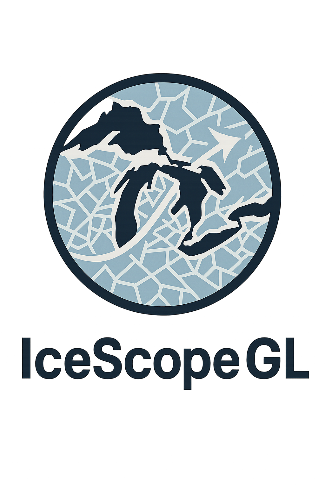

## 📄 License

This project is open source under the **MIT License**.  
Full license text is available in the `LICENSE` file in the repository.

  

---

# 📖 About the Project

In winter, Great Lakes operators need fast answers to questions like:

- **What will ice look like along this route in the next few days?**
- **Is there a safer path that still fits our schedule?**
- **How are lake temperatures changing near key choke points?**

IceScope GL (our **Great Lakes Ice Ops prototype**) pulls these pieces together in one interface with three panels:

---

## 🧊 Ice Forecast

- 4-day ice products: **Concentration, Thickness, Type**
- Playback bar with frame stepping and speed control
- Legends fetched from backend (or fallbacks), **color-blind-friendly when enabled**
- Export map snapshots for briefings and reports

---

## 🧭 Best Route

Advisory routing across the Great Lakes with:

- Port presets (**Detroit, Chicago, Duluth, etc.**)
- Draggable start/destination markers + quick swap button
- Vessel inputs: **draft, ice class, speed**

Backend cost grid:

- **Land polygons → impassable**
- **Ice polygons → higher cost where concentration rises**

A* pathfinder returns a route that:

- Never crosses land  
- Prefers lower-ice corridors  
- Stays between requested ports  

Returned as **GeoJSON**, overlaid on the live map, exportable or shareable via URL params.

---

## 🌡 Temps

- Current lake temperatures + **48-hour outlook**
- Powered by **Open-Meteo (no API key)**
- °F / °C toggle
- Quick-pick chips to jump between basins

---

## 🔮 Future Work

- **Stronger forecast models**  
  Replace the AR(1) baseline with ConvLSTM or other spatiotemporal models trained on multi-year GLSEA + ice data.
- **Weather coupling**  
  Add wind, air temperature, and wave forecasts (GFS/HRRR) so ice evolution responds to storms and cold outbreaks.
- **Vessel-specific risk**  
  Include draft, power, and certified ice class directly in the routing cost to produce ship-specific safe tracks.
- **Multi-criteria routing**  
  Let users choose between shortest time, lowest ice exposure, or lowest fuel use and display multiple candidate routes.
- **Interactive “what-if” tools**  
  Drag waypoints, adjust tolerance to heavy ice, lock corridors, and instantly re-run A* with updated constraints.
- **Operational integration**  
  Export layers and routes in standard formats usable by Coast Guard and commercial navigation systems.

  ---

## 🌐 Live Demo

🔗 **https://mi-space-hackathon-2025.vercel.app**

---

## 🛠 Built With

---

## 👍 Like This Project?

If you enjoyed it, please give the repo a star ⭐  

